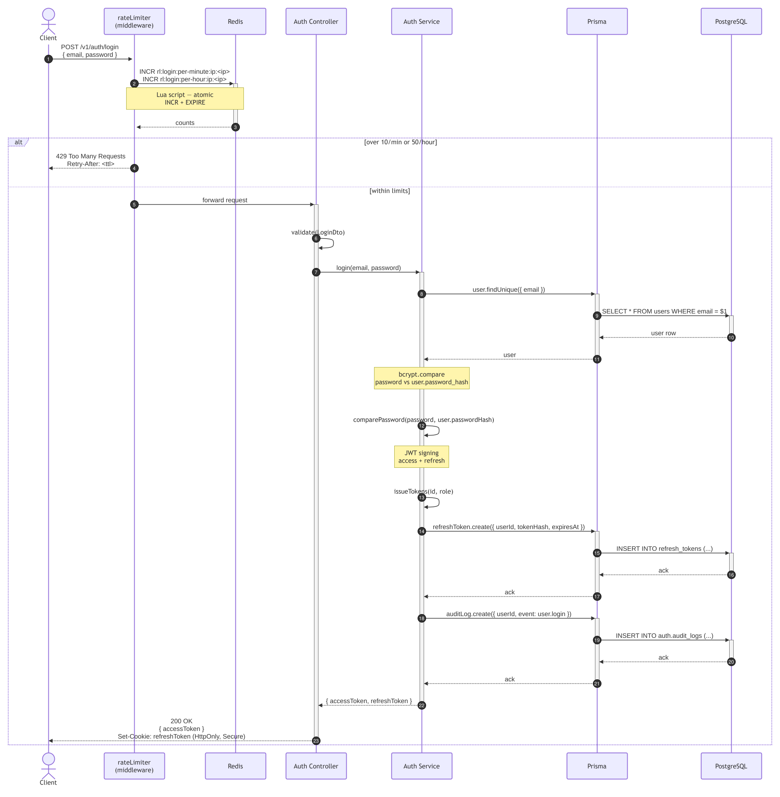
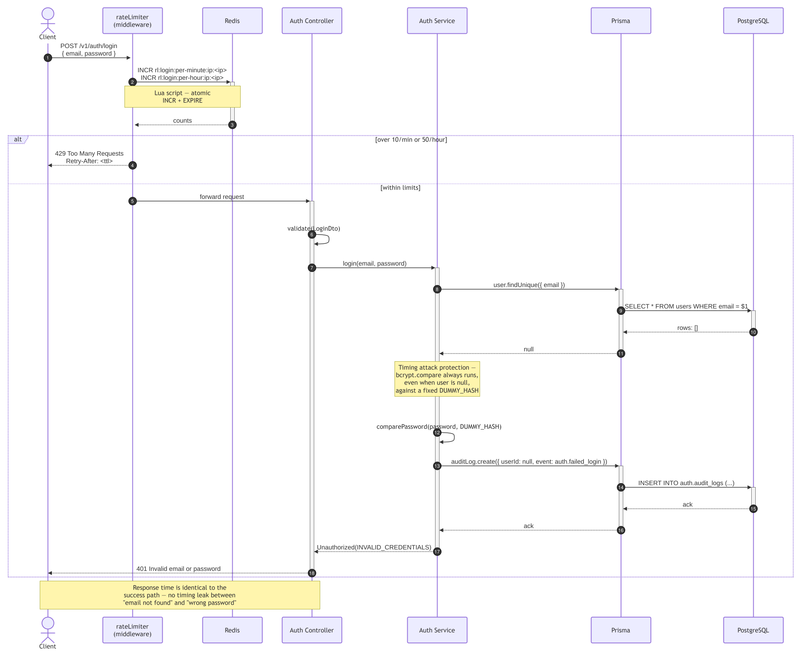
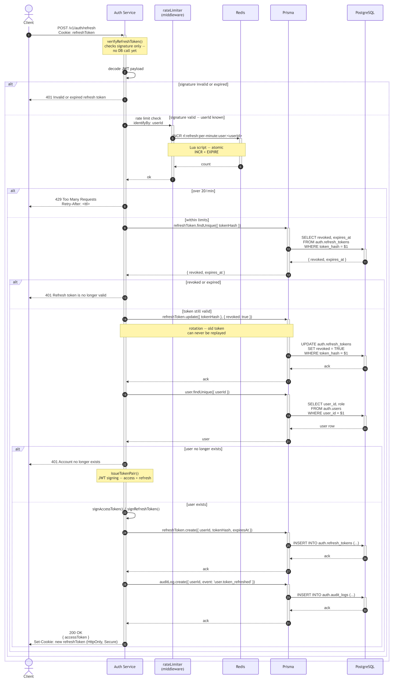
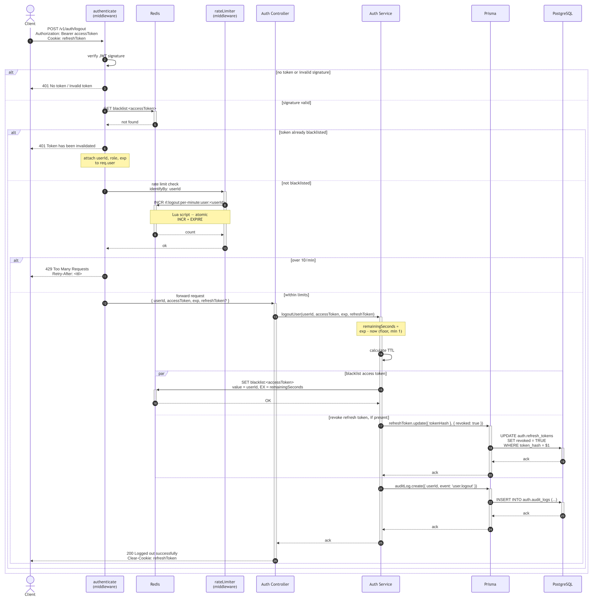
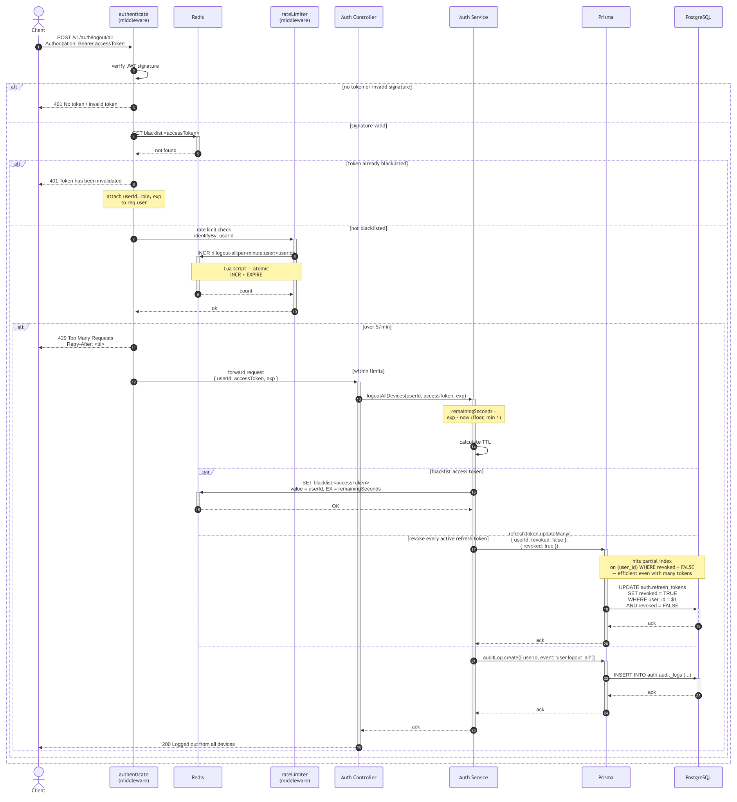
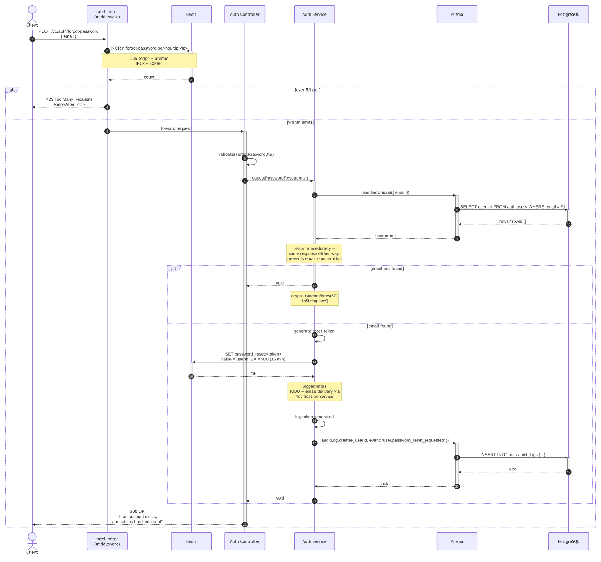

# Auth Service — Sequence Diagrams

## Version

V1

---

## 1. Register

Validates the request, rate-limits by IP, checks for an existing email, hashes
the password with bcrypt, creates the user and refresh token via Prisma, then
publishes a `user.registered` event to RabbitMQ for async audit logging.

## .drawio.svg>)

---

## 2. Login — Success

Validates credentials, rate-limits by IP, compares password against the stored
bcrypt hash, issues a new token pair, and publishes a `user.login` event to
RabbitMQ for audit logging.



---

## 3. Login — Failed (timing attack protection)

Same request path as a successful login, but runs `bcrypt.compare` against a
fixed dummy hash when no user is found — keeping response time identical
between "email not found" and "wrong password" to prevent enumeration.

## 

---

## 4. Token Refresh — Rotation

Verifies the refresh token's signature first — a pure in-memory
cryptographic check, no Redis or database call — to extract the userId,
since there's no access token available to authenticate with at this
endpoint. That userId is then used to rate-limit via Redis (20/min per
user). Once within limits, the token is checked against the database,
rotated (the old one is revoked and can never be replayed), and a brand
new access/refresh pair is issued.

## 

---

## 5. Logout — Single Device

Authenticates the request (JWT signature + blacklist check), rate-limits
by the now-known userId, then blacklists the access token in Redis and
revokes the refresh token in the database in parallel — the refresh token
revocation only runs if a refresh token cookie was actually present.



---

## 6. Logout — All Devices

Authenticates the request and rate-limits by userId (5/min — stricter than
single-device logout), then blacklists the current access token in Redis
and revokes every active refresh token for the user in parallel, hitting
the partial index on `(user_id) WHERE revoked = FALSE` for efficiency even
with many active sessions.



---

## 7. Forgot Password

Rate-limits by IP (5/hour), then looks up the email. Whether or not an
account exists, the client receives the identical response — this prevents
attackers from using the endpoint to enumerate registered emails. If found,
a single-use reset token is generated and stored in Redis with a 15-minute
TTL; email delivery is a TODO pending the Notification Service.



---

## 8. Reset Password

```
Client                    Auth Service              PostgreSQL            Redis
  |                            |                        |                   |
  |-- POST /v1/auth/---------->|                        |                   |
  |   reset-password           |                        |                   |
  |   { token, newPassword }   |                        |                   |
  |                            |-- validate (zod) ------>|                   |
  |                            |                        |                   |
  |                            |-- GET password_reset:<token>           --->|
  |                            |<-- userId or null -----|------------------ |
  |                            |                        |                   |
  |                (not found) |-- throw 400 ---------->|                   |
  |<-- 400 token invalid ------|                        |                   |
  |    or expired              |                        |                   |
  |                            |                        |                   |
  |                (found) --->|                        |                   |
  |                            |-- hashPassword() ----->|                   |
  |                            |   bcrypt, 12 rounds    |                   |
  |                            |                        |                   |
  |                            |-- Promise.all() ------->|                   |
  |                            |   UPDATE users -------->|                  |
  |                            |   SET password_hash=$1 |                   |
  |                            |   DEL password_reset:<token>           --->|
  |                            |   (single-use enforced)|                   |
  |                            |   UPDATE refresh_tokens>|                  |
  |                            |   SET revoked = TRUE   |                   |
  |                            |   (all devices)        |                   |
  |                            |                        |                   |
  |                            |-- writeAuditLog() ----->|                   |
  |                            |   user.password_reset_completed            |
  |                            |                        |                   |
  |<-- 200 Password reset -----|                        |                   |
  |    successfully            |                        |                   |
```

---

## 9. Authenticated Request — Token Blacklist Check

```
Client               API Gateway              Redis           Auth Service
  |                       |                     |                  |
  |-- ANY protected ------>|                     |                  |
  |   request              |                     |                  |
  |   Authorization: Bearer|                     |                  |
  |                        |-- verifyJWT() ------>|                  |
  |                        |   check signature   |                  |
  |                        |                     |                  |
  |          (invalid) ----|-- 401 Invalid token >|                  |
  |<-- 401 ---------------|                     |                  |
  |                        |                     |                  |
  |          (valid) ------>|                     |                  |
  |                        |-- GET blacklist:<token>                |
  |                        |                     |                  |
  |          (found) ------>|                     |                  |
  |                        |-- logger.warn() ---->|                  |
  |<-- 401 invalidated ----|                     |                  |
  |                        |                     |                  |
  |          (not found) -->|                     |                  |
  |                        |-- forward request -->|-- to service    |
```
